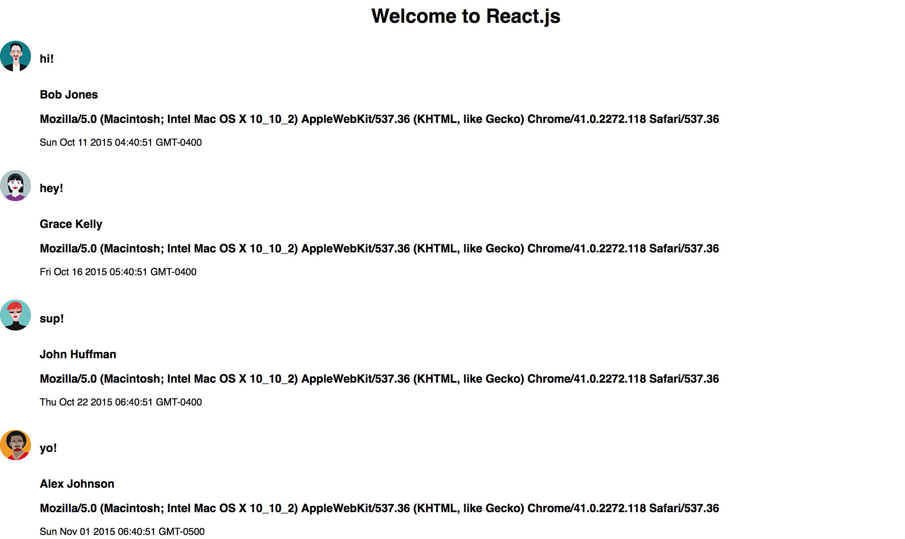

#### Take-Home Code Challenge

I created a simple single page react.js app that pulls information from this endpoint  http://private-227b9-jsonapifizzbuzz.apiary-mock.com/messages.
I created this application using create-react-app and react router. I used axios to make the api calls and react router to add a /messages route.



## Getting Started/Running Locally

1. Install yarn
```shell
  yarn
```
2. Bundle JavaScript Files
```shell
  webpack
```

3. Run the server http://localhost:8080/
```
npm run dev
```
## Routes

 http://localhost:8080/messages

## Technology

The application is currently using the following technologies:
* Languages: HTML, SASS, JavaScript
* Frameworks/Libraries: React.js, Axios, Moment.js, React Router

## Author
* [Anthony Ciccone](https://github.com/anticcone/)
